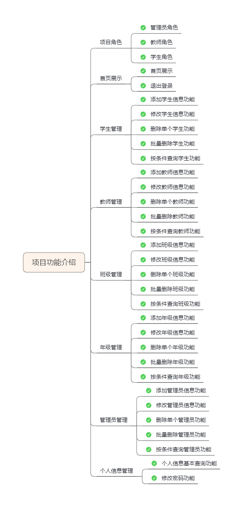

## 智慧校园小项目

### 具体的业务功能

>  开发工具和技术栈

1 操作系统的选择

​			开发者使用Windows10 /11 ,项目运行环境为Linux.服务容器使用Tomcat

2 开发使用的工具

​			前端开发工具为HbuilderX,配合NodeJS运行时

​          后端开发工具为Idea,使用maven作为项目构建工具

3 数据库管理系统

​			mysql8作为数据库服务,同时配合 Navicat / Sqlyog 可视化数据库前端工具

4 相关框架  

​			VUE 独立开发前端代码

​		   SpringBoot 快速搭建后端服务

​          MyBatisPlus 快速实现数据操作,同时优化业务层代码

​          swagger2 快速生成接口文档,同时可以帮助接口测试

​          fastjson 快速实现前后端数据转换

​			commons-fileupload 快速实现文件上传

>  项目的架构模式和开发模式

架构模式: MVC三层技术模型

开发模式:前后端分离的开发模式

>  进度和计划

1 需求分析      在导师的指导下,同时阅读相关文献,了解学校的实际的管理工作内容,同时接受一些新的管理理念,完成需求调研

2 数据库设计  在明确需求的情况下,对数据库进行设计

3 资料收集      根据要应用的技术,大量阅读资料,收集相关文献,问后续的编码做准备

4 接口设计      根据具体的业务项,开始逐一设计接口

5 模块实现       具体功能的实现

6 测试程序,整理资料,撰写文档